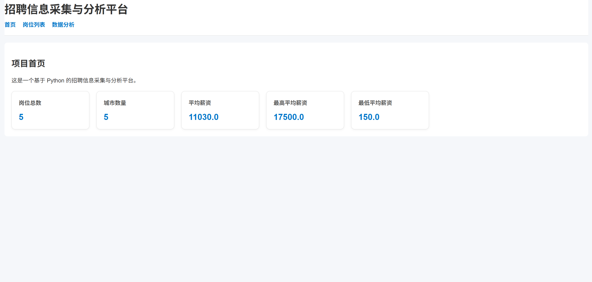
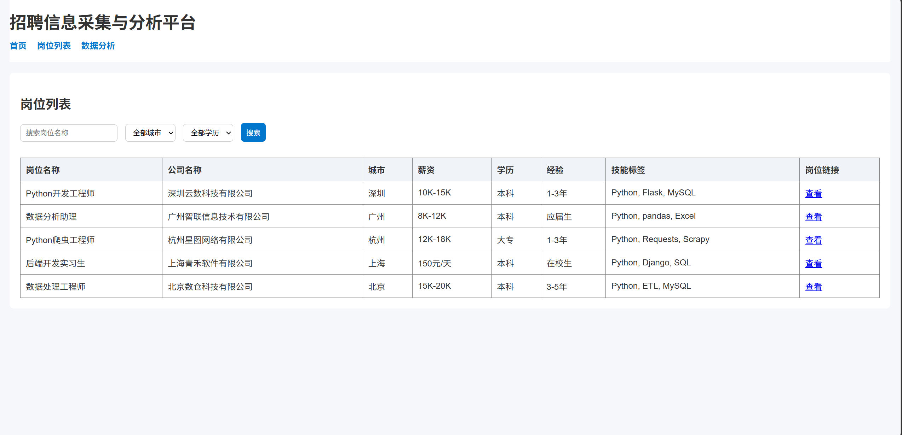
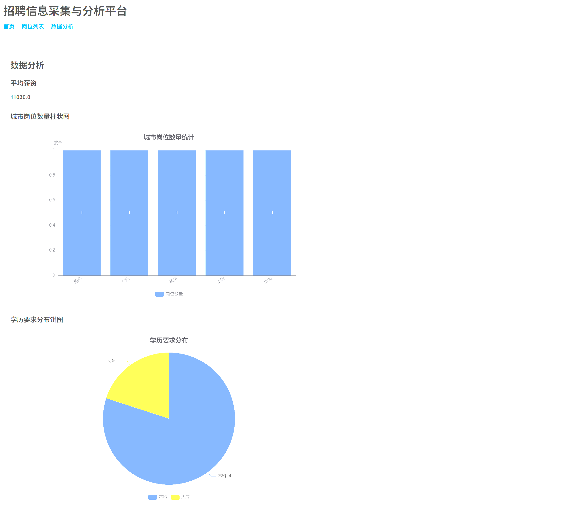

# 招聘信息采集与分析平台
## Job Data Analysis Platform

一个基于 Python 的个人练手项目，用于实现招聘岗位数据的采集、清洗、存储、分析和可视化展示。

---

## 项目简介

本项目面向 Python 学习与实习求职场景，目标是构建一个完整的小型数据分析系统。  
项目通过采集招聘岗位样本数据，提取岗位名称、公司名称、城市、薪资、学历要求、经验要求等核心字段，并对数据进行清洗、结构化处理、MySQL 存储以及 Flask 网页展示。

该项目主要用于展示以下能力：

- Python 基础开发
- 数据采集与处理
- pandas 数据清洗
- MySQL 数据库存储
- Flask Web 开发
- HTML / CSS 页面搭建
- 基础数据分析与可视化
- Git / GitHub 项目管理

---

## 功能介绍

### 已实现功能

- 招聘岗位样本数据采集
- 原始数据保存为 JSON
- 数据清洗与字段标准化
- 薪资字段解析（salary_min / salary_max）
- 清洗后数据导出为 CSV
- MySQL 数据库存储
- Flask 首页展示
- 岗位列表展示
- 关键词搜索功能
- 城市筛选功能
- 学历筛选功能
- 数据分析页面
- 城市岗位数量柱状图
- 学历要求分布饼图
- 平均薪资、最高薪资、最低薪资统计

---

## 技术栈

- **Backend:** Python, Flask
- **Database:** MySQL, SQLAlchemy, PyMySQL
- **Data Processing:** pandas
- **Data Source Handling:** JSON, CSV
- **Frontend:** HTML, CSS
- **Visualization:** pyecharts
- **Version Control:** Git, GitHub

---

## 项目结构

```text
job-data-analysis-platform/
│
├── app.py
├── config.py
├── crawler.py
├── clean_data.py
├── save_to_db.py
├── requirements.txt
├── README.md
├── .gitignore
│
├── data/
│   ├── raw/
│   │   └── raw_jobs.json
│   └── processed/
│       └── clean_jobs.csv
│
├── models/
│   ├── __init__.py
│   └── job.py
│
├── templates/
│   ├── base.html
│   ├── index.html
│   ├── jobs.html
│   └── analysis.html
│
├── static/
│   ├── css/
│   │   └── style.css
│   └── js/
│       └── main.js
│
└── docs/
    └── project_design.md
```

---

## 核心流程
1. 使用 crawler.py 生成岗位原始样本数据
2. 使用 clean_data.py 清洗和结构化处理数据
3. 使用 save_to_db.py 将数据写入 MySQL
4. 使用 app.py 提供 Flask 页面展示与分析功能

---

## 页面展示
### 首页


### 岗位列表页


### 数据分析页


---

## 环境要求
- Python 3.11+ 或 3.12+
- MySQL 8.x
- pip
- Windows / macOS / Linux

---

## 项目亮点

- 独立完成从数据样本生成、清洗、入库到网页展示的完整流程
- 使用 pandas 对薪资字段进行解析和结构化处理
- 使用 MySQL 存储结构化岗位数据
- 使用 Flask 实现数据展示和条件筛选
- 使用 pyecharts 实现基础可视化分析
- 项目具备较完整的后端、数据库和前端展示链路

---

## 作者

- GitHub: 胡刻堂主
- Email: 2225418643@qq.com
